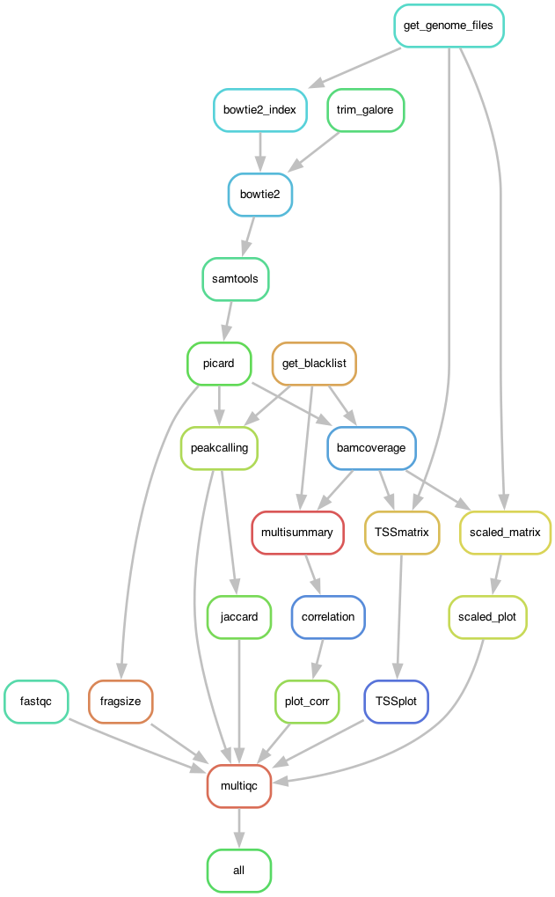

# ChIP-seq Analysis Pipeline


### Setup Environment

- Clone Repository
```
git clone https://ascgitlab.helmholtz-muenchen.de/public_pipelines/chipseq_pipeline.git
cd chipseq_pipeline
```

- Download Miniconda (Mac version)
```
curl -LO https://repo.anaconda.com/miniconda/Miniconda3-latest-MacOSX-x86_64.sh
```

- Install Miniconda
```
bash Miniconda3-latest-MacOSX-x86_64.sh
```

- Initialize Conda
```
conda init
```

- Install Mamba to base environment
```
conda install -c conda-forge mamba
```

- Create environment
```
mamba env create --name env_chipseq_pipeline --file configs/env_chipseq_pipeline.yaml
```
- Activate environment
```
conda activate env_chipseq_pipeline
```

- Save yaml file of the environment
```
conda env export > configs/env_chipseq_pipeline_versions.yaml
```

### Test Pipeline

- IDs in the ```SampleTable.txt``` file ```Run``` column with ```{SRR}``` ID should match the FastQ file pairs ```FastQ/{SRR}_1.fastq.gz``` and ```FastQ/{SRR}_2.fastq.gz```

- The provided test files in this repository contain only 100,000 reads and have the ```test_``` prefix in their filename

- The current workflow outputs were generated on the full FastQ files, that can be downloaded from the Sequence Read Archive (SRA) using SRA tools  ```fastq-dump``` (not part of the workflow)

- For your files edit ```SampleTable.txt``` and place the matching ```{SRR}_1.fastq.gz``` and ```{SRR}_1.fastq.gz``` files to the ```FastQ``` folder

- Dry run

```
snakemake -np > logs/snakemake_log.txt
snakemake --rulegraph | dot -Tpng > logs/snakemake_rulegraph.png
```

### Run Pipeline


- Set ```-j``` to the desired number of parallel jobs
```
nohup snakemake -j 16 > logs/snakemake_run.out &
```

### Graph


